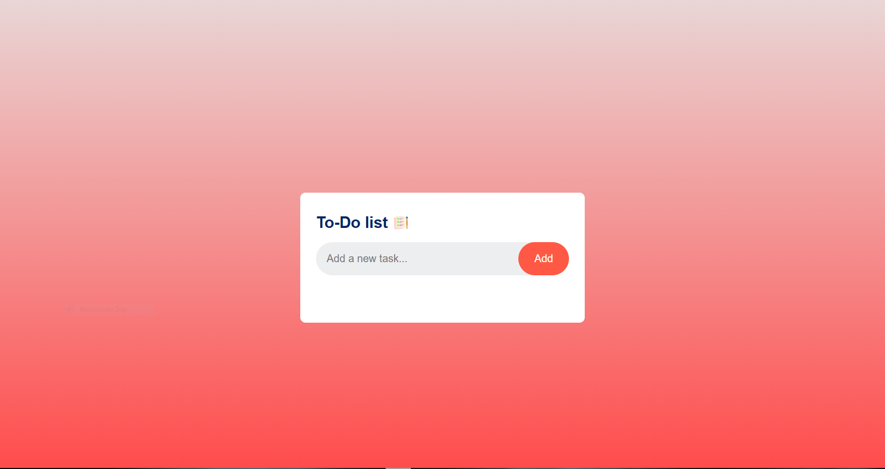

<h1 align="center">📝 To-Do List Web App</h1>

<p align="center">
  A clean, animated, and beginner-friendly To-Do list app using <b>HTML</b>, <b>CSS</b>, and <b>JavaScript</b>.
</p>

<p align="center">
  
  
  
</p>

---

### 🌟 Live Preview

<div align="center">
  
</div>

---

## ⚙️ Features

✅ Add new tasks  
🎯 Mark tasks as completed  
❌ Remove tasks with a click  
💅 Hover animations and smooth transitions  
📱 Responsive on all screen sizes  
🌈 Modern gradient UI

---

## 🛠️ Tech Stack

| Frontend | Styling | Functionality |
|----------|---------|---------------|
| HTML     | CSS     | JavaScript    |
| Vanilla  | Tailwind-inspired UI | DOM Manipulation |

---

💡 How To Use
✏️ Type your task into the input bar
➕ Click “Add” to add it to the list
✅ Click on a task to mark it complete
❌ Click the × to delete the task

🎨 UI Highlights
✨ Animated checkmarks and hover effects
💅 Elegant button styles
🔘 Circle radio icons for task completion
🌈 Gradient background layout
📱 Mobile-first and fully responsive

🧠 Ideas for Expansion
🧠 Save tasks to Local Storage
🌙 Add a Dark Mode toggle
🗂 Task categories and filtering
📝 Make tasks editable in-place

🛠️ Getting Started
bash
Copy
Edit
# Clone the repository
git clone https://github.com/hussincode/To-Do-list.git

# Navigate into the directory
cd To-Do-list

# Open index.html in your browser
🤝 Contribute
If you'd like to improve the UI/UX, add new features, or simply practice open source — feel free to fork and contribute!

bash
Copy
Edit
# Fork the repo
# Make your changes
# Submit a Pull Request
👤 About the Author
Hussin Hesham
🎓 Front-End Developer & Tech Enthusiast
🔗 LinkedIn | 🌐 Portfolio

⭐ Support
If you found this useful or cool:

👉 Star this repo
🗣 Share it with your friends
👀 Watch for future updates

<p align="center"> Made with ❤️ by <a href="https://github.com/hussincode">Hussin Hesham</a> </p> ```

## 🚀 Getting Started

```bash
# 1. Clone the repository
git clone https://github.com/hussincode/To-Do-list.git

# 2. Navigate into the directory
cd To-Do-list

# 3. Open in your browser
Open index.html

